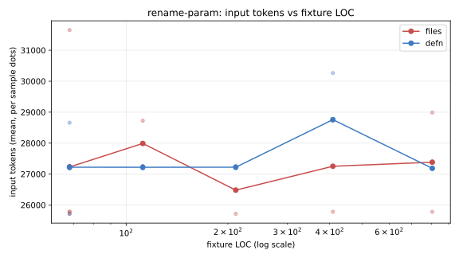
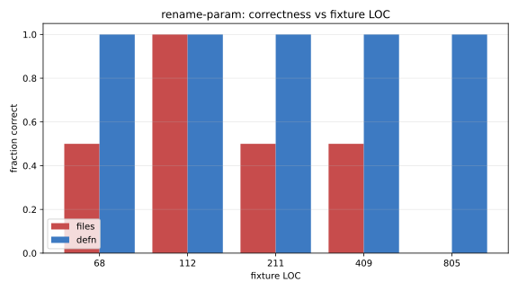
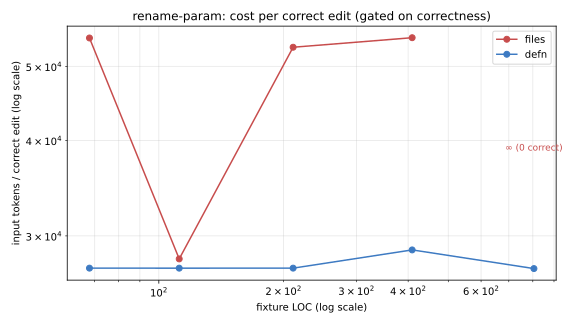

# rename-param fixture-size sweep — 2026-07-10

**Verdict: null result. Kills the "crossover curve" marketing claim
(see [`../README.md`](../README.md), playbook move #4). Receipt kept
because the honesty pledge says publish it even when it doesn't help.**

## What we ran

Sweep the `rename-param` mutation across 7 fixture sizes, 2 samples
per (size, mode), in both `files` mode (Read/Edit) and `defn` mode
(the `code` MCP `rename-param` op). Fixture is a `Process(data
[]byte, verbose bool)` function whose `data` param is used ~15 times
in scattered locations, plus size-parameterized padding functions
around it that never reference `data`. The mutation site is
positionally stable (Process signature at line ~13); only the
surrounding padding grows with LOC.

Correctness = `mustContain` (all four `payload` uses) AND
`mustNotContain` (any `data []byte` / `len(data)` / etc. remaining)
under whitespace-canonicalized comparison.

Reproduce:

```bash
go run ./cmd/defn-bench --size-sweep --sweep-mutation rename-param --samples 2 \
  --size-sweep-csv bench/mutations/2026-07-10-rename-sweep.csv
.venv-bench/bin/python3 bench/mutations/plot_rename_sweep.py \
  bench/mutations/2026-07-10-rename-sweep.csv
```

Raw stream-json for every case is checked in as
`raw-size-<loc>-s<sample>-<mode>.jsonl` next to this doc — so any
finding here can be re-verified without a re-run.

## What we found

### 1. No input-token crossover exists at LOC ≤ 800



Per-size mean input tokens (thousands):

| LOC | files | defn |
|-----|-------|------|
| 10  | 27.2  | 27.3 |
| 25  | 25.8  | 27.9 |
| 50  | 28.7  | 26.5 |
| 100 | 28.0  | 27.2 |
| 200 | 26.5  | 27.2 |
| 400 | 27.3  | 28.8 |
| 800 | 27.4  | 27.2 |

Deltas are all within ~2k tokens and the sign flips with fixture
size — that's noise, not a curve. The ~25k `claude -p` headless
floor (see [`../README.md`](../README.md) caveats §1) dominates the
signal. Nothing to plot as a "defn saves N% at scale" claim.

### 2. Files-mode correctness dropped — but this is likely a harness artifact



- files: **6 / 14 correct (43%)**
- defn: **14 / 14 correct (100%)**

Files-mode failures cluster at ≥25 LOC and are usually 2-tool-call
runs (Read + one Edit) that miss `data` uses further down the file.
Defn-mode always calls the AST-safe `rename-param` op, so it never
misses.

**Why this doesn't clear the honesty gate for a marketing claim:**
this bench runs `claude -p` in headless mode — no CLAUDE.md, no
multi-turn back-and-forth, no user "wait, you missed one" nudge. A
real user in an interactive session almost certainly gets a higher
files-mode hit rate. Publishing "43% vs 100%" would sell an
artifact-driven number as a product win.

The correctness gap is real *in headless* single-shot rename. That's
a niche buyer, not the pitch.

### 3. Cost per correct edit



Total input tokens / correct-run count, log scale. Files-mode has
∞ (0 correct) points at 25 and 800 LOC. This is derivable from the
above two, not a new finding — included for the receipts pledge to
show every angle we looked at.

## What this changes

- **Retire playbook move #4 (crossover curve) as scoped.** The
  crossover doesn't exist on the workload class we tested.
  [`../README.md`](../README.md) updated.
- **The v9 chain-bench token win (~-28%) is unaffected.** Chains are
  multi-op multi-file; the read-tax cost model that fails to bite
  here does bite there. Different workload class.
- **Retrieval P@10 win is unaffected.** Different workload class.

## Followups

- **Larger fixtures (target 4k–8k LOC)** may still expose a
  crossover — if the ~25k floor stops dominating. Real spend, not
  scheduled. Blocked on user confirmation.
- **Interactive-session correctness bench** — does the files-mode
  correctness gap survive a proper session (not `claude -p`)? If no,
  correctness claim dies too. If yes, it's a real but narrow buyer.
- **`add-import` sweep is dead** as designed — goimports strips the
  added-but-unused import on emit, so the post-condition always
  fails. Retained in `--sweep-mutation add-import` for future work
  that pairs it with a usage-adding edit.
